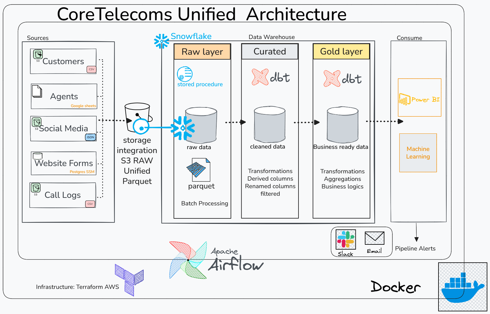
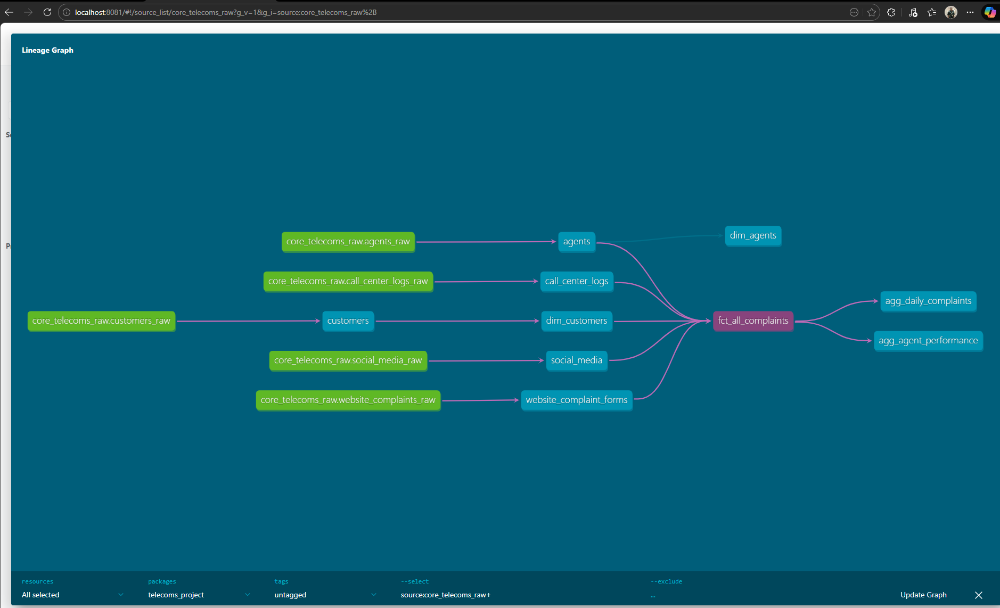
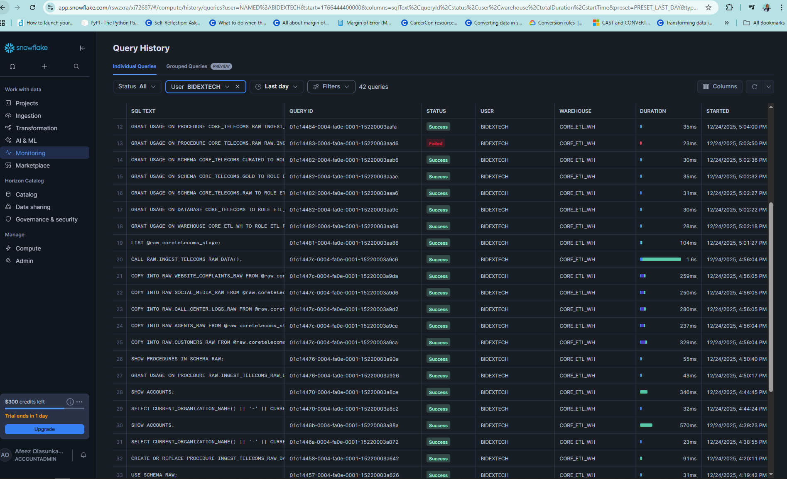
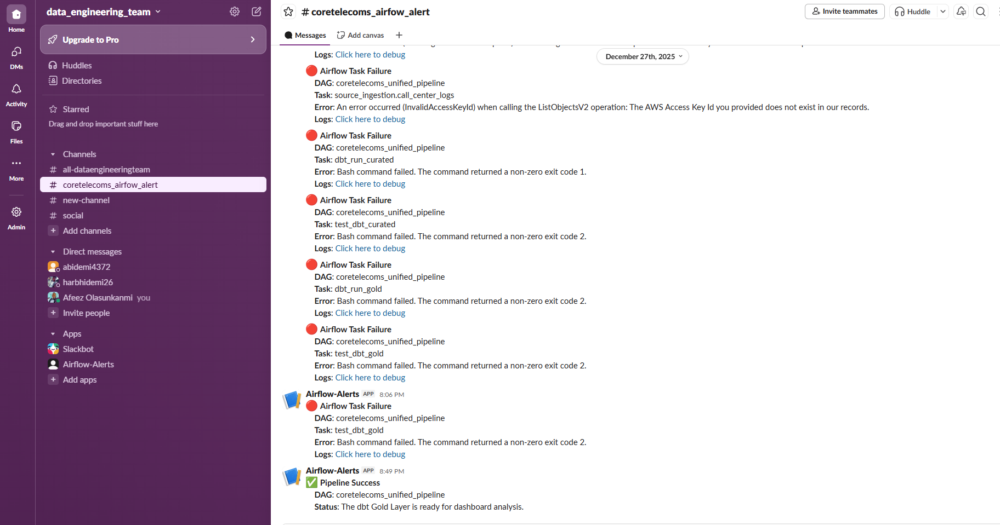
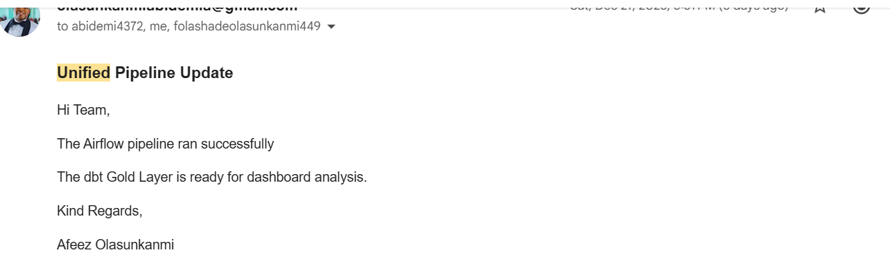
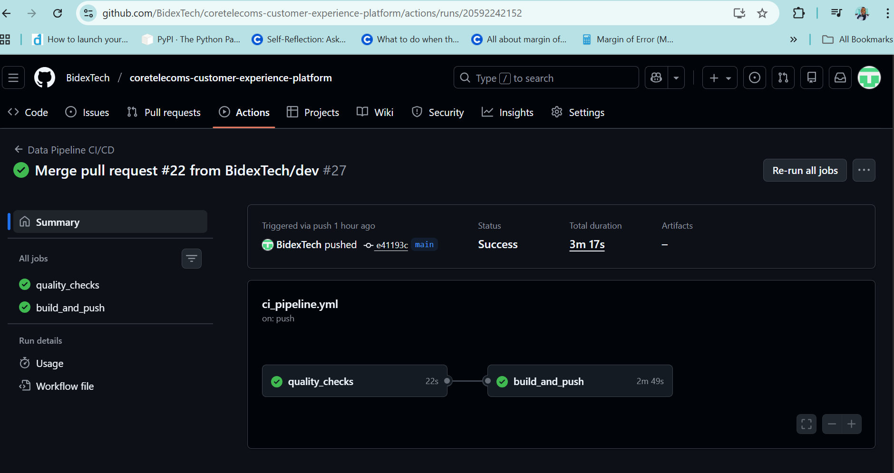
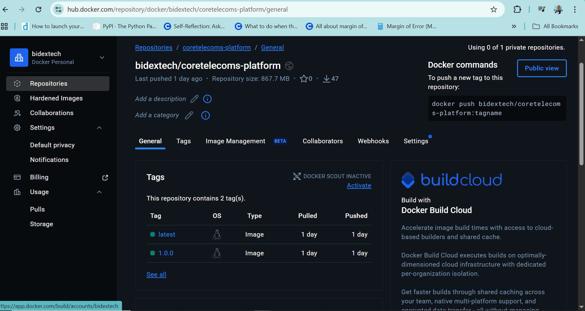

# 📡 CoreTelecoms Customer Experience Platform


## Project Overview / Background

The Core Telecoms Customer Experience Platform is designed to centralize, clean, and transform multi-channel customer complaints data to support business analytics and reporting. The project integrates call center logs, social media complaints, website complaint forms, customers and agent information into a unified data model. The Gold layer aggregates data for dashboards and analytics to monitor customer complaints trends and agent performance.

This project implements a modern ELT pipeline orchestrated with Apache Airflow.
Data from five independent sources is ingested into an S3 data lake (RAW zone), loaded into a Snowflake data warehouse as RAW tables, and transformed with dbt into CURATED and GOLD layers following the medallion architecture.

---

## Project Structure
```text
coretelecoms-customer-experience-platform/
├── .github/          # CI/CD Workflows (Flake8, Sqlfluff, Terraform, Docker Build)
├── assets/           # Project diagrams and documentation images
├── credentials/      # Service account keys (Google Sheets API, etc.) - [GIT IGNORED]
├── dags/             # Airflow ingestion & dbt orchestration DAGs
├── dbt/              # Modular SQL models (curated, Gold)
├── snowflake/        # DDL bootstrapping and Stored Procedures
├── src/              # Custom Python ingestion & enrichment logic
├── terraform-infra/  # AWS & Snowflake Infrastructure-as-Code
├── .env.example      # Template for environment variables
├── .dockerignore
├── README.md
├── .gitignore
├── .env
├── Dockerfile
├── docker-compose.yaml
└── requirements.txt


```

---
## Architecture Design

<p align="center">
  
</p>

> **Architecture Overview:** This diagram illustrates the end-to-end flow from multi-source ingestion (S3, GSheets, Postgres) to the Snowflake Medallion layers, all orchestrated via Airflow 3.1.5.
---

## ⛓️ Pipeline Workflow Logic

The platform follows a modular **ELT (Extract, Load, Transform)** pattern, orchestrated by Airflow 3.1.5 and processed within Snowflake.

### 1. Ingestion Layer (Parallel Processing)
To minimize data latency, the pipeline utilizes **Airflow TaskGroups** to ingest multiple source datasets in parallel into a unified **AWS S3 Raw Bucket** in Parquet format:
* **Datasets:** Customers, Call Center Logs, Social Media Sentiment, Web Complaints, and Agent Performance.
* **Format:** Parquet (Optimized for storage and Snowflake ingestion).

### 2. Loading & Staging
Once the data lands in S3, the pipeline executes a **Snowflake Stored Procedure**:
* **Command:** `CALL RAW.INGEST_TELECOMS_RAW_DATA();`
* **Purpose:** Uses Snowflake's compute power to bulk-load data from the S3 stage into raw database tables, maintaining atomicity and performance.

### 3. Transformation Layer (Medallion Architecture)
Using **dbt (Data Build Tool)**, the data is transformed through two primary stages:
* **Curated Layer:** Cleaning, deduplication, and schema enforcement. Includes automated `dbt test` suites to ensure data quality before moving forward.
* **Gold Layer:** Business-level modeling where customer behavior and churn propensity metrics are calculated.

### 4. Observability & Notifications
The pipeline is "Self-Aware" and provides real-time status updates:
* **Success Notifications:** Sends detailed HTML reports via **SMTP** to stakeholders and triggers a **Slack Success Alert** via callbacks.
* **Data Quality:** Every transformation step is followed by a testing task; the pipeline halts if a `dbt test` fails, preventing "bad data" from reaching the Gold layer.

---

## Logic Flow Overview
The dependency graph below represents the actual execution order:
`Source Ingestion (Parallel)` → `Load to Snowflake` → `dbt Curated` → `dbt Test` → `dbt Gold` → `dbt Test` → `Success Alerts`

## Choice of Tools and Technology

This project utilizes a Modern Data Stack (MDS) architecture, ensuring scalability, reliability, and portability:

* **Infrastructure:** Terraform (AWS S3 & Snowflake policy document and role setup).
* **Orchestration:** Apache Airflow 3.1.5 (Running in Docker with CeleryExecutor).
* **Transformation:** dbt (Data Build Tool) for modular SQL modeling.
* **Data Warehouse:** Snowflake (Multi-cluster compute).
* **CI/CD:** GitHub Actions (Linting, Validation, and Automated Docker Builds).
* **Monitoring:** Slack & SMTP integration for pipeline health alerts.

---

## ⚙️ CI/CD Pipeline Logic

> **Broken code never hits production.**

## Continuous Integration (CI)

Every push to the `dev` branch triggers automated quality checks:

- **flake8** — Python linting  
- **sqlfluff** — SQL linting  
- **terraform validate** — Infrastructure configuration validation  

---

## Continuous Deployment (CD)

Merges to the `main` branch trigger a GitHub Actions workflow that:

- Builds a new production Docker image  
- Pushes the image to Docker Hub:

```bash
bidextech/coretelecoms-platform:1.0.0
```

##  Orchestration & Transformation
### 1. Airflow Workflow
The DAG automates the ingestion from S3 to Snowflake.


### 2. dbt Data Lineage
Visualizing the transformation logic from staging to analytics marts.


### 3. Snowflake Verification
Proof of data processing within the Snowflake Query History.


---

## 🔐 Monitoring & Alerts
The platform proactively notifies the team of pipeline status via Slack and Email.

| Slack Alerts | Email Notifications |
| :--- | :--- |
|  |  |

---

## ⚙️ CI/CD & Infrastructure
### GitHub Actions Pipeline
Automated linting and validation on every push.


### Production Docker Image
The containerized build pushed to Docker Hub.



##  Quick Start: Local Deployment

### 1. Prerequisites
* [Docker Desktop](https://www.docker.com/products/docker-desktop/)
* A Snowflake Account
* AWS IAM Credentials
* DBT-core

### 2. Setup
Clone the repository and prepare your environment:
```bash
git clone https://github.com/BidexTech/coretelecoms-customer-experience-platform.git
cd coretelecoms-customer-experience-platform
cp .env.example .env  # Update with your Snowflake credentials for dbt communication

# Build and start all services:

docker-compose up -d --build
```
| Tool           | URL                                            | Credentials                                  |
| -------------- | ---------------------------------------------- | -------------------------------------------- |
| **Airflow UI** | [http://localhost:8080](http://localhost:8080) | `airflow / airflow`                              |
| **dbt Docs**   | Run inside container: `dbt docs generate`      | Generates data lineage & model documentation |

### 3. Add connection in Airflow UI

| Connection ID    | Type      | Description                                             |
| ---------------- | --------- | ------------------------------------------------------- |
| `aws_default`    | AWS       | Pulls raw CSV/JSON logs from S3 landing zones           |
| `snowflake_conn` | Snowflake | Executes dbt models and performs data loading           |
| `slack_conn`     | HTTP      | Sends pipeline failure/success alerts to `#data-alerts` |
| `smtp_conn`   | Email     | Sends daily performance PDF reports to business leads      |


## Notes

* The platform is designed for easy extension for additional data sources and analytical metrics.

Author

- Afeez Olasunkanmi
- Date Engineer
- olasunkanmiabidemia@gmail.com
- [LinkedIn](https://linkedin.com/in/afeez-olasunkanmi-874827236)
